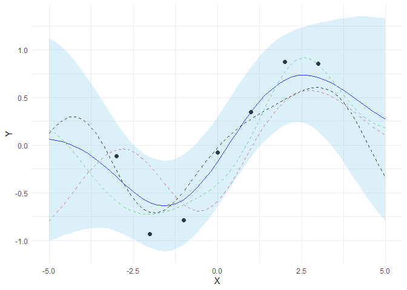

README
================

# Bayesian Optimization

The purpose of this project is to gain a deeper understanding of
Bayesian Optimization and its practical application in data analysis and
simulation. Bayesian Optimization is an increasingly popular topic in
the field of Machine Learning. It allows us to find an optimal
hyperparameter configuration for a particular machine learning algorithm
without too much human intervention. Bayesian Optimization has several
advantages compared to other optimization algorithm. The first advantage
of Bayesian Optimization is that it does not require hand-tuning or
expert knowledge, which makes it easily scalable for larger, more
complicated analysis. The second advantage of Bayesian Optimization is
when evaluations of the fitness function are expensive to perform. If
the fitness function \(f\) is cheap to evaluate we could sample at many
points e.g. via grid search, random search or numeric gradient
estimation. However, if function evaluation is expensive e.g. tuning
hyperparameters of a deep neural network, probe drilling for oil at
given geographic coordinates or evaluating the effectiveness of a drug
candidate taken from a chemical search space then it is important to
minimize the number of samples drawn from the black box function \(f\).

## Project Organization

  - The `analysis` folder contains Rmarkdown files (along with knitted
    versions for easy viewing) with the code used to run simulations and
    analyze and visualize the results.

  - The `data` folder contains the New York Stock Exchange dataset used
    for this simulation. Data is imported from Kaggle (
    <https://www.kaggle.com/dgawlik/nyse> ).

  - The `R` folder contains the scripts for the functions required to
    execute the simulation.

  - The `reports` folder contains deliverables such as project proposal
    and final report.

  - The `results` folder contains files generated files generated during
    clean-up and analysis as well as the final result of the simulation.

  - The man and R directories include the R functions used to run
    Bayesian Optimizaiton as well as documentation for the functions.
    Documentation for each function can be rendered using the standard R
    syntax (e.g. ?function()).

## Gaussian Process

Gaussian Process is a probabilistic model to approximate based on a
given set of data points. Gaussian Process models a function as a set of
random variables whose joint distribution is a multivariate normal
distribution, with a specific mean vector and covariance matrix.

\[
f(x_{1:k}) \sim \mathcal{N}(\mu(x_{1:k}), \Sigma(x_{1:k},x_{1:k}))
\]

Where,

  - \(\mathcal{N}(x,y)\): Gaussian/Normal random distribution
  - \(\mu(x_{i:k})\): Mean vector of each \(f(x_i)\)
  - \(\Sigma(x_{i:k}, x_{i:K})\): Covariance matrix of each pair of
    \(f(x_i)\)

For a candidate point \(x'\), its function value \(f(x')\) can be
approximated, given a set of observed values \(f(x_{1:n})\), using the
posterior distribution,

\[
f(x)|f(x_{1:n}) \sim \mathcal{N}(\mu_n(x), \sigma_n^2(x))
\]

Where,

\[
\mu_n(x) = \Sigma_0(x,x_{i:n}) \ast \Sigma_0(x_{i:n},x_{i:n})^{-1} \ast (f(x_{1:n}) - \mu_0(x_{1:n})) + \mu_0(x) \\
\sigma_n^2(x) = \Sigma_0(x,x) - \Sigma_0(x, x_{i:n}) \ast \Sigma_0(x_{i:n},x_{i:n})^{-1} \ast \Sigma_0(x_{i:n},x)
\]

Below is the example of Gaussian Process posterior over function graph.
The following example draws three samples from the posterior and plots
them along with the mean, confidence interval and training data.

``` r
noise <- 0.4
gpr <- gpr.init(sigma_y = noise)

# Finite number of points
X <- seq(-5, 5, 0.2)

# Noisy training data
X_train <- seq(-3, 3, 1)
Y_train <- sin(X_train) + noise * rnorm(n = length(X_train))
gpr <- gpr.fit(X_train, Y_train, gpr)

# Compute mean and covariance of the posterior predictive distribution
result <- gpr.predict(X, gpr)
mu_s <- result$mu_s
cov_s <- result$cov_s

samples <- mvrnorm(n = 3, mu = mu_s, Sigma = cov_s)
plot_gp(mu_s, cov_s, X, X_train, Y_train, samples)
```

<!-- -->
