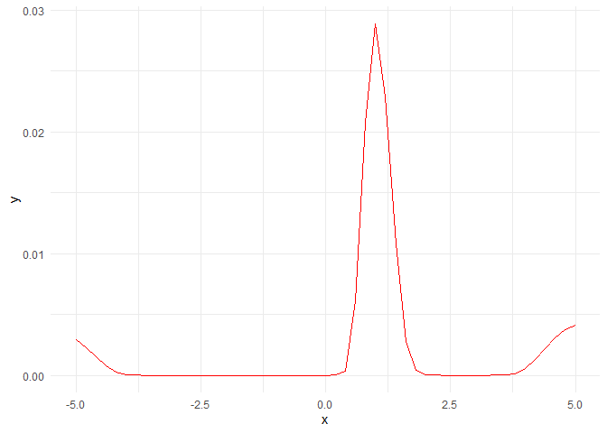

Portfolio Allocation using Bayesian Optimization
================

The purpose of this project is to gain a deeper understanding of
Bayesian Optimization and its practical application in data analysis and
simulation. Bayesian Optimization is an increasingly popular topic in
the field of Machine Learning. It allows us to find an optimal
hyperparameter configuration for a particular machine learning algorithm
without too much human intervention. Bayesian Optimization has several
advantages compared to other optimization algorithm. The first advantage
of Bayesian Optimization is that it does not require hand-tuning or
expert knowledge, which makes it easily scalable for larger, more
complicated analysis. The second advantage of Bayesian Optimization is
when evaluations of the fitness function are expensive to perform. If
the fitness function 
is cheap to evaluate we could sample at many points e.g. via grid
search, random search or numeric gradient estimation. However, if
function evaluation is expensive e.g. tuning hyperparameters of a deep
neural network, probe drilling for oil at given geographic coordinates
or evaluating the effectiveness of a drug candidate taken from a
chemical search space then it is important to minimize the number of
samples drawn from the black box function
.

### Project Organization

  - The `analysis` folder contains Rmarkdown files (along with knitted
    versions for easy viewing) with the code used to run simulations and
    analyze and visualize the results.

  - The `data` folder contains the New York Stock Exchange dataset used
    for this simulation. Data is imported from Kaggle (
    <https://www.kaggle.com/dgawlik/nyse> ).

  - The `R` folder contains the R functions used to run Bayesian
    Optimization

  - The `reports` folder contains deliverables such as project proposal
    and final report.

  - The `results` folder contains files generated files generated during
    clean-up and analysis as well as the final result of the simulation.

  - The `man` folder contains documentation for the functions defined in
    the `R` folder. Documentation for each function can be rendered
    using the standard R syntax (e.g. `?function`).

### Gaussian Process

Gaussian Process is a probabilistic model to approximate based on a
given set of data points. Gaussian Process models a function as a set of
random variables whose joint distribution is a multivariate normal
distribution, with a specific mean vector and covariance
matrix.


Where,

  - :
    Gaussian/Normal random
    distribution
  - :
    Mean function of each
    . It is common to use
     as  Gaussian Process is flexible enough to model the mean arbitrarily well
  - :
    Kernel function/covariance function at each pair of
    

For a candidate point
, its function
value  can
be approximated, given a set of observed values
,
using the posterior
distribution,


Where,

  - 
  - 

Below is the example of Gaussian Process posterior over function graph.
The following example draws three samples from the posterior and plots
them along with the mean, confidence interval and training data.

``` r
noise <- 0.4
gpr <- gpr.init(sigma_y = noise)

# Finite number of points
X <- seq(-5, 5, 0.2)

# Noisy training data
X_train <- seq(-3, 3, 1)
Y_train <- sin(X_train) + noise * rnorm(n = length(X_train))
gpr <- gpr.fit(X_train, Y_train, gpr)

# Compute mean and covariance of the posterior predictive distribution
result <- gpr.predict(X, gpr)
mu_s <- result$mu_s
cov_s <- result$cov_s

samples <- mvrnorm(n = 3, mu = mu_s, Sigma = cov_s)
plot_gp(mu_s, cov_s, X, X_train, Y_train, samples)
```

<!-- -->

This implementation can also be used for higher input data dimensions.
Here, a GP is used to fit noisy samples from a sine wave originating at
0 and expanding in the x-y plane. The following plots show the noisy
samples and the posterior predictive mean before and after kernel
parameter optimization.

``` r
noise_2D <- 0.1
gpr_2D <- gpr.init(sigma_y = noise_2D)

rx <- seq(-5, 5, 0.3)

X_2D <- as.matrix(
    data.frame(
        rep(rx, times = length(rx)),
        rep(rx, each = length(rx))
    )
)

X_2D_train <- as.matrix(
    data.frame(
        runif(n = 100, min = -4, max = 4),
        runif(n = 100, min = -4, max = 4)
    )
)

Y_2D_train <- sin(0.5 * sqrt(X_2D_train[,1]^2 + X_2D_train[,2]^2)) +
              noise_2D * rnorm(len(X_2D_train))

gpr_2D <- gpr.fit(X_2D_train, Y_2D_train, gpr_2D)
result <- gpr.predict(X_2D, gpr_2D)
mu_s <- array(result$mu_s, c(length(rx), length(rx)))

persp3D(x=rx, y=rx, z=mu_s,
        theta=30, phi=20, alpha=0.5)
```

<!-- -->

### Acquisition Function

Acquisition function is employed to choose which point of
 that we will take
the sample next. The chosen point is those with the optimum value of
acquisition function. The acquisition function calculate the value that
would be generated by evaluation of the fitness function at a new point
, based on the
current posterior distribution over
.

Acquisition function tries to find the balance between exploitation and
exploration. Exploitation means sampling where the surrogate model
predicts a high objective and exploration means sampling at locations
where the prediction uncertainty is high. Both correspond to high
acquisition function values and the goal is to maximize the acquisition
function to determine the next sampling point.

Below is the illustration of the acquisition function value curve. The
value is calculated using expected improvement method. Point with the
highest value of the acquisition function will be sampled at the next
round/iteration.

``` r
EI <- expected_improvement(X, gpr)
plot_acquisition(X, EI)
```

<!-- -->

There are several choice of acquisition function, such as expected
improvement, upper confidence bound, entropy search, etc. Here we will
be using the expected improvement
function.


Where,


  - : Best
    value of
     of the
    sample
  - : Mean
    of the GP posterior predictive at
    
  - :
    Standard deviation of the GP posterior predictive at
    
  - : `xi` (some
    call `epsilon` instead). Determines the amount of exploration during
    optimization and higher
     values lead
    to more exploration. A common default value for
     is 0.01.
  - : The
    cumulative density function (CDF) of the standard normal
    distribution
  - : The
    probability density function (PDF) of the standard normal
    distribution

## Bayesian Optimization

Now we have all components needed to run Bayesian optimization with the
algorithm outlined above.

Bayesian optimization runs for 10 iterations. In each iteration, a row
with two plots is produced. The left plot shows the noise-free objective
function, the surrogate function which is the GP posterior predictive
mean, the 95% confidence interval of the mean and the noisy samples
obtained from the objective function so far. The right plot shows the
acquisition function. The vertical dashed line in both plots shows the
proposed sampling point for the next iteration which corresponds to the
maximum of the acquisition function.

<!-- -->

## Portfolio Optimization

Portfolio optimization problem is concerned with managing the portfolio
of assets that minimizes the risk objectives subjected to the constraint
for guaranteeing a given level of returns. One of the fundamental
principles of financial investment is diversification where investors
diversify their investments into different types of assets. Portfolio
diversification minimizes investors exposure to risks, and maximizes
returns on portfolios.

The fitness function is the adjusted Sharpe Ratio for restricted
portofolio, which combines the information from mean and variance of an
asset and functioned as a risk-adjusted measure of mean return, which is
often used to evaluate the performance of a portfolio.

The Sharpe ratio can help to explain whether a portfolio’s excess
returns are due to smart investment decisions or a result of too much
risk. Although one portfolio or fund can enjoy higher returns than its
peers, it is only a good investment if those higher returns do not come
with an excess of additional risk.

The greater a portfolio’s Sharpe ratio, the better its risk-adjusted
performance. If the analysis results in a negative Sharpe ratio, it
either means the risk-free rate is greater than the portfolio’s return,
or the portfolio’s return is expected to be negative.

The fitness function is shown
below:


**Subject
    To**

  - 

  - 

  - 

Where,

  - : Number of
    different assets
  - : Weight of
    each stock in the portfolio
  - : Return of
    stock 
  - : The test
    available rate of return of a risk-free security (i.e. the interest
    rate on a three month U.S. Treasury bill)
  - :
    Covariance between returns of assets
     and
    

Adjusting the portfolio weights
, we can maximize
the portfolio Sharpe Ratio in effect balancing the trade-off between
maximizing the expected return and at the same time minimizing the risk.

### Algorithm Evaluation

We're going to test our algorithm on the New York Stock Exchange dataset and compare our
performance to the one obtained using `rBayesianOptimization` package and the Particle Swarm Optimization algorithm.

Suppose I have assets in 3 different randomly chosen stocks, in this case they are,

* `NFX`: Newfield Exploration Co
* `ORLY`: O'Reilly Automotive
* `ULTA`: Ulta Salon Cosmetics & Fragrance Inc

How should I distribute my assets in such a way that maximizes the Sharpe Ratio, given the constraints? We will only use data from January to March of 2015 for illustration.

#### Implementation from scratch

Let’s run the algorithm `bayesian_optimization()` that we implemented.
The parameters include:

  - `FUN`: the fitness function
  - `lower`: the lower bounds of each variables
  - `upper`: the upper bounds of each variables
  - `init_grid_dt`: user specified points to sample the target function
  - `init_points`: number of randomly chosen points to sample the target
    function before Bayesian Optimization fitting the Gaussian Process
  - `n_iter`: number of repeated Bayesian Optimization
  - `xi`: tunable parameter  of Expected Improvement, to balance
    exploitation against exploration, increasing `xi` will make the
    optimized hyper parameters more spread out across the whole range
  - `noise`: represents the amount of noise in the training data
  - `max`: specifies whether we’re maximizing or minimizing a function
  - `acq`: choice of acquisition function (Expected Improvement by
    default)
  - `naive`: choice between a naive implementation (direct inverse) vs a numerically more stable implementation (least squares approximation using QR decomposition)

<!-- end list -->

``` r
bayes_finance <- bayesian_optimization(FUN=sharpe_ratio, lower=lower, upper=upper,
                                          init_grid_dt=search_grid)
```

    ## $par
    ##         w1         w2         w3 
    ## 0.04205953 0.21640794 0.75330786 
    ## 
    ## $value
    ## [1] -138640

Result of the function consists of a list with 2 components:

  - `par`: a vector of the best hyperparameter set found
  - `value`: the value of metrics achieved by the best hyperparameter set

So, what is the optimum Sharpe Ratio from Bayesian optimization?

``` r
bayes_finance$value
```

    ## [1] -138640

The greater a portfolio’s Sharpe ratio, the better its risk-adjusted
performance. If the analysis results in a negative Sharpe ratio, it
either means the risk-free rate is greater than the portfolio’s return,
or the portfolio’s return is expected to be negative.

Let’s check the total weight of the optimum result.

``` r
sum(bayes_finance$par)
```

    ## [1] 1.011775

Our weights violate the constraint, which is probably the reason why our
Sharpe’s Ratio is negative. More work can be done to improve sampling
for next  as well as
finding the optimum value for parameters
 and
.

Based on Bayesian Optimization, here is how your asset should be
distributed.

    ##   stock                             Security weight
    ## 1  ULTA Ulta Salon Cosmetics & Fragrance Inc 75.33%
    ## 2  ORLY                  O'Reilly Automotive 21.64%
    ## 3   NFX              Newfield Exploration Co  4.21%

#### `rBayesianOptimization` Package

Let’s compare our result to the one obtained using
`rBayesianOptimization`
package.

``` r
rbayes_finance <- BayesianOptimization(FUN = fitness, bounds = search_bound, 
                     init_grid_dt = search_grid, n_iter = 10, acq = "ei")
```

    ## elapsed = 0.02   Round = 1   w1 = 0.2876 w2 = 0.8895 w3 = 0.1428 Value = -1.023468e+08 
    ## elapsed = 0.00   Round = 2   w1 = 0.7883 w2 = 0.6928 w3 = 0.4145 Value = -8.021977e+08 
    ## elapsed = 0.00   Round = 3   w1 = 0.4090 w2 = 0.6405 w3 = 0.4137 Value = -2.145617e+08 
    ## elapsed = 0.01   Round = 4   w1 = 0.8830 w2 = 0.9943 w3 = 0.3688 Value = -1.552847e+09 
    ## elapsed = 0.00   Round = 5   w1 = 0.9405 w2 = 0.6557 w3 = 0.1524 Value = -5.604287e+08 
    ## elapsed = 0.00   Round = 6   w1 = 0.0456 w2 = 0.7085 w3 = 0.1388 Value = -1.147189e+07 
    ## elapsed = 0.00   Round = 7   w1 = 0.5281 w2 = 0.5441 w3 = 0.2330 Value = -9.315046e+07 
    ## elapsed = 0.00   Round = 8   w1 = 0.8924 w2 = 0.5941 w3 = 0.4660 Value = -9.073010e+08 
    ## elapsed = 0.00   Round = 9   w1 = 0.5514 w2 = 0.2892 w3 = 0.2660 Value = -1.135660e+07 
    ## elapsed = 0.00   Round = 10  w1 = 0.4566 w2 = 0.1471 w3 = 0.8578 Value = -2.130340e+08 
    ## elapsed = 0.00   Round = 11  w1 = 0.9568 w2 = 0.9630 w3 = 0.0458 Value = -9.325547e+08 
    ## elapsed = 0.00   Round = 12  w1 = 0.4533 w2 = 0.9023 w3 = 0.4422 Value = -6.365379e+08 
    ## elapsed = 0.00   Round = 13  w1 = 0.6776 w2 = 0.6907 w3 = 0.7989 Value = -1.362358e+09 
    ## elapsed = 0.00   Round = 14  w1 = 0.5726 w2 = 0.7955 w3 = 0.1219 Value = -2.401001e+08 
    ## elapsed = 0.00   Round = 15  w1 = 0.1029 w2 = 0.0246 w3 = 0.5609 Value = -9.704073e+07 
    ## elapsed = 0.00   Round = 16  w1 = 0.8998 w2 = 0.4778 w3 = 0.2065 Value = -3.412339e+08 
    ## elapsed = 0.00   Round = 17  w1 = 0.2461 w2 = 0.7585 w3 = 0.1275 Value = -1.744483e+07 
    ## elapsed = 0.00   Round = 18  w1 = 0.0421 w2 = 0.2164 w3 = 0.7533 Value = -1.386400e+05 
    ## elapsed = 0.00   Round = 19  w1 = 0.3279 w2 = 0.3182 w3 = 0.8950 Value = -2.928402e+08 
    ## elapsed = 0.00   Round = 20  w1 = 0.9545 w2 = 0.2316 w3 = 0.3745 Value = -3.142636e+08 
    ## elapsed = 0.00   Round = 21  w1 = 0.9749 w2 = 0.0000 w3 = 0.0000 Value = -6.276665e+05 
    ## elapsed = 0.00   Round = 22  w1 = 0.0000 w2 = 0.0000 w3 = 1.0000 Value = 16.2381 
    ## elapsed = 0.00   Round = 23  w1 = 0.7114 w2 = 0.0000 w3 = 0.2841 Value = -2.088616e+04 
    ## elapsed = 0.00   Round = 24  w1 = 0.0000 w2 = 0.9980 w3 = 0.0000 Value = -4032.3122 
    ## elapsed = 0.00   Round = 25  w1 = 0.7790 w2 = 0.1572 w3 = 0.0581 Value = -3.316038e+04 
    ## elapsed = 0.00   Round = 26  w1 = 0.0076 w2 = 0.4095 w3 = 0.5954 Value = -1.575054e+05 
    ## elapsed = 0.00   Round = 27  w1 = 0.0000 w2 = 0.5964 w3 = 0.4066 Value = -9006.5778 
    ## elapsed = 0.02   Round = 28  w1 = 0.0020 w2 = 0.8404 w3 = 0.1630 Value = -2.871837e+04 
    ## elapsed = 0.00   Round = 29  w1 = 0.1507 w2 = 0.0048 w3 = 0.8444 Value = -21.0078 
    ## elapsed = 0.00   Round = 30  w1 = 0.0781 w2 = 0.0000 w3 = 0.9129 Value = -8.003892e+04 
    ## 
    ##  Best Parameters Found: 
    ## Round = 22   w1 = 0.0000 w2 = 0.0000 w3 = 1.0000 Value = 16.2381

The solution has a Sharpe Ratio of 16.2381 with the following weight.

    ##   stock                             Security  weight
    ## 1  ULTA Ulta Salon Cosmetics & Fragrance Inc 100.00%
    ## 2   NFX              Newfield Exploration Co   0.00%
    ## 3  ORLY                  O'Reilly Automotive   0.00%

The solution has a higher Sharpe ratio than our implementation. Both
implementations agree that ULTA is the most profitable asset.

#### Particle Swarm Optimization

Let’s compare the optimum Sharpe ratio from Bayesian Optimization with
another algorithm: Particle Swarm Optimization. PSO will run for 10,000
iterations with swarm size of 100. If in 500 iterations there is no
improvement on the fitness value, the algorithm will stop.

``` r
pso_finance <- psoptim(par = rep(NA,3), fn = function(x){-fitness(x)}, 
        lower = rep(0,3), upper = rep(1,3), 
        control = list(maxit = 10000, s = 100, maxit.stagnate = 500))
```

    ## $par
    ## [1] 0.18286098 0.01961205 0.79752697
    ## 
    ## $value
    ## [1] -19.2006
    ## 
    ## $counts
    ##  function iteration  restarts 
    ##    107700      1077         0 
    ## 
    ## $convergence
    ## [1] 4
    ## 
    ## $message
    ## [1] "Maximal number of iterations without improvement reached"

The solution has a Sharpe Ratio of 19.2006 with the following weight.

    ##   stock                             Security weight
    ## 1  ULTA Ulta Salon Cosmetics & Fragrance Inc 79.75%
    ## 2   NFX              Newfield Exploration Co 18.29%
    ## 3  ORLY                  O'Reilly Automotive  1.96%

For this problem, PSO works better than Bayesian Optimization, indicated
by the optimum fitness value. However, we only ran 30 function
evalutions (20 from samples, 10 from iterations) with Bayesian
Optimization, compared to PSO, which run more than 1000 evaluations. The
trade-off is Bayesian Optimization ran slower than PSO, since the
function evaluation is cheap.

#### Normalization

We could also normalize our search grid to ensure that the weights don’t
add up to more than 1, therefore not violating the constraint.

``` r
search_grid <- normalize(search_grid)
bayes_finance_norm <- bayesian_optimization(FUN=sharpe_ratio, lower=lower, upper=upper,
                                        init_grid_dt=search_grid)
```

    ## $par
    ##         w1         w2         w3 
    ## 0.14949415 0.03575043 0.81475542 
    ## 
    ## $value
    ## [1] 19.69707

The solution has a Sharpe Ratio of 19.6971. We achieve a higher
performance than both `rBayesianOptimization` and Particle Swarm Optimization\!

Based on normalized Bayes, here is how your asset should be distributed.

    ##   stock                             Security weight
    ## 1  ULTA Ulta Salon Cosmetics & Fragrance Inc 81.48%
    ## 2   NFX              Newfield Exploration Co 14.95%
    ## 3  ORLY                  O'Reilly Automotive  3.58%
    
#### Pushing the limit

Our implementation uses QR decomposition to find the least squares
approximation to avoid having to compute the inverse of a close to singular
matrix. This means that our implementation is numerically more stable but it is also
tolerant to slight fluctuations in the fitness value. Suppose we want to
make it stricter by using the naive implementation, but at the cost of
being less stable.

``` r
bayes_finance_allnorm <- bayesian_optimization(FUN=sharpe_ratio, lower=lower, upper=upper,
                                        init_grid_dt=search_grid, n_iter=1, naive=TRUE)
```

    ## $par
    ##        w1        w2        w3 
    ## 0.1336573 0.1222349 0.7441082 
    ## 
    ## $value
    ## [1] 20.13223

The solution has a Sharpe Ratio of 20.1322 which is even higher than the
previous one! However, keep in mind that this only works after setting `n_iter` to just 1 iteration.

Based on the naive implementation, here is how your asset should be
distributed.

    ##   stock                             Security weight
    ## 1  ULTA Ulta Salon Cosmetics & Fragrance Inc 74.41%
    ## 2   NFX              Newfield Exploration Co 13.37%
    ## 3  ORLY                  O'Reilly Automotive 12.22%

### References

[1] Martin Krasser. [Gaussian Processes](https://krasserm.github.io/2018/03/19/gaussian-processes/)<br />
[2] Martin Krasser. [Bayesian Optimization](http://krasserm.github.io/2018/03/21/bayesian-optimization/)<br />
[3] Arga Adyatama. [Introduction to Bayesian Optimization](https://rpubs.com/Argaadya/bayesian-optimization)<br />
[4] Mikhail Popov. [A tutorial on Bayesian optimization in R](https://bearloga.github.io/bayesopt-tutorial-r/)<br />
[5] Arga Adyatama. [Introduction to Particle Swarm Optimization](https://rpubs.com/Argaadya/intro-PSO)<br />
[6] Matthew Hoffman, Eric Brochu & Nando de Freitas (2011). [Portfolio Allocation for Bayesian Optimization](https://www.cs.ubc.ca/~nando/papers/uaiBayesOpt.pdf)<br />
[7] Zhu, H., Wang, Y., Wang, K., & Chen, Y. (2011). [Particle Swarm Optimization (PSO) for the constrained portfolio optimization problem](https://www.sciencedirect.com/science/article/abs/pii/S0957417411002818?via%3Dihub)