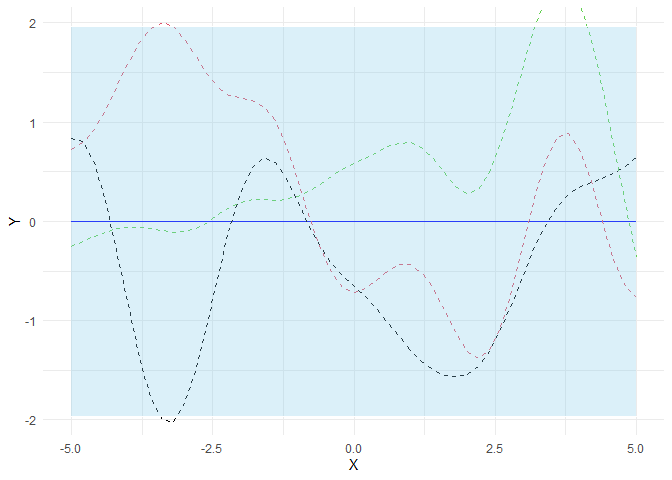
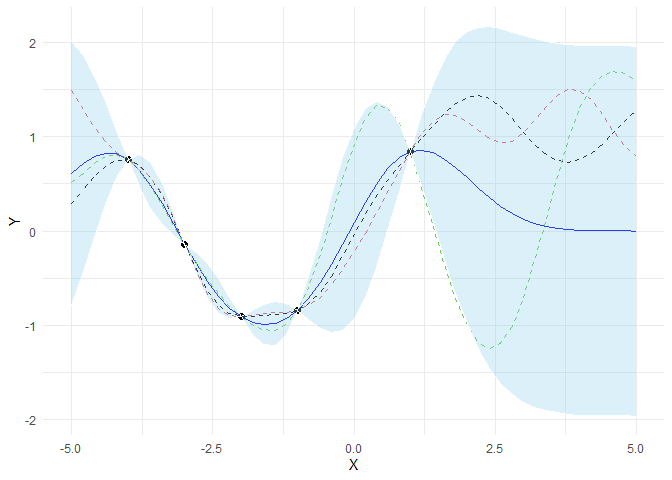
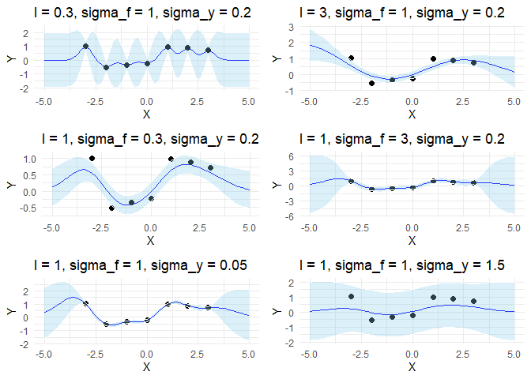
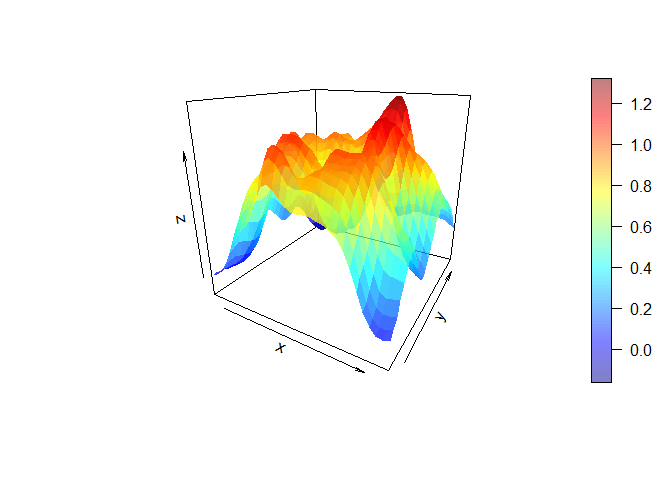
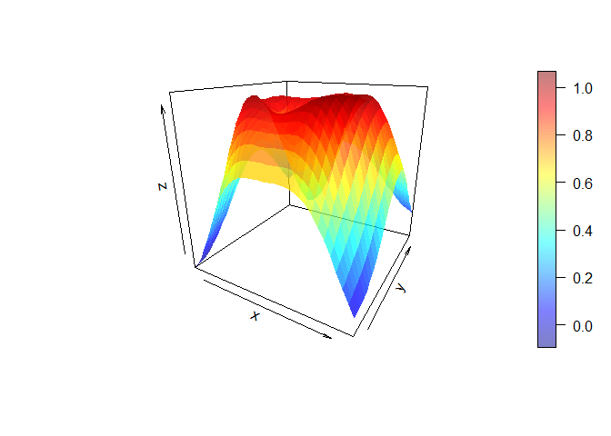

Gaussian Process
================
Ivan Timothy Halim
12/2/2020

# Gaussian processes

## Introduction

In supervised learning, we often use parametric models

to explain data and infer optimal values of parameter
 via maximum
likelihood or maximum a posteriori estimation. If needed we can also
infer a full posterior distribution

instead of a point estimate
.
With increasing data complexity, models with a higher number of
parameters are usually needed to explain data reasonably well. Methods
that use models with a fixed number of parameters are called parametric
methods.

In non-parametric methods, on the other hand, the number of parameters
depend on the dataset size. For example, in Nadaraya-Watson kernel
regression, a weight
 is assigned to
each observed target
 and for predicting
the target value at a new point
 a weighted average
is computed:


Observations that are closer to
 have a higher weight
than observations that are further away. Weights are computed from
 and observed
 with a kernel
. A special
case is k-nearest neighbor (KNN) where the
 closest observations
have a weight , and
all others have weight
. Non-parametric
methods often need to process all training data for prediction and are
therefore slower at inference time than parametric methods. On the other
hand, training is usually faster as non-parametric models only need to
remember training data.

Another example of non-parametric methods are Gaussian processes (GPs).
Instead of inferring a distribution over the parameters of a parametric
function Gaussian processes can be used to infer a distribution over
functions directly. A Gaussian process defines a prior over functions.
After having observed some function values it can be converted into a
posterior over functions. Inference of continuous function values in
this context is known as GP regression but GPs can also be used for
classification.

A Gaussian process is a random process where any point

is assigned a random variable
 and where the
joint distribution of a finite number of these variables

is itself Gaussian:


Where,

-   
-   
-   

 is the mean function
and it is common to use
 as
GPs are flexible enough to model the mean arbitrarily well.
 is a positive
definite *kernel function* or *covariance function*. Thus, a Gaussian
process is a distribution over functions whose shape (smoothness, …) is
defined by . If
points  and
 are considered to
be similar by the kernel the function values at these points,
 and
, can be
expected to be similar too.

Given a training dataset with noise-free function values
 at inputs
, a GP prior can be
converted into a GP posterior

which can then be used to make predictions
 at new inputs
. By definition of
a GP, the joint distribution of observed values
 and prediction
 is again a
Gaussian which can be partitioned into


Where,

-   
-   

With  training data
and  new input
data,

-    is a
    
    matrix
-    is a
    
    matrix
-    is a
    
    matrix

Using standard rules for conditioning Gaussians, the predictive
distribution is given by


Where,

-   
-   

If we have a training dataset with noisy function values

where noise

is independently added to each observation then the predictive
distribution is given by


Where,

-   
-   
-   

Although Equation (6) covers noise in training data, it is still a
distribution over noise-free predictions
. To additionally
include noise
 into
predictions  we
have to add
 to the
diagonal of 


using the definitions of
 and
 from
Equations (7) and (8), respectively. This is the minimum we need to know
for implementing Gaussian processes and applying them to regression
problems. For further details, please consult the literature in the
References section. The next section shows how to implement GPs from
scratch.

## Implementation

Here, we will use the squared exponential kernel, also known as Gaussian
kernel or RBF kernel:


The length parameter 
controls the smoothness of the function and
 the
vertical variation. For simplicity, we use the same length parameter
 for all input
dimensions (isotropic kernel).

``` r
gaussian_kernel <- function(x, y, l = 1.0, sigma_f = 1.0) {
    if (is.null(dim(x))) {
        sqdist <- outer(x^2, y^2, '+') - 2 * x %*% t(y)
    } else {
        sqdist <- outer(rowSums(x^2), rowSums(y^2), '+') - 2 * x %*% t(y)
    }
    sigma_f^2 * exp(-0.5 / l^2 * sqdist)
}
```

There are many other kernels that can be used for Gaussian processes.
See \[3\] for a detailed reference or the scikit-learn documentation for
some examples.

### Prior

Let’s first define a prior over functions with mean zero and a
covariance matrix computed with kernel parameters
 and
.
To draw random functions from that GP we draw random samples from the
corresponding multivariate normal. The following example draws three
random samples and plots it together with the zero mean and the 95%
confidence interval (computed from the diagonal of the covariance
matrix).

``` r
# Finite number of points
X <- seq(-5, 5, 0.2)

# Mean and covariance of the prior
mu <- numeric(length(X))
cov <- gaussian_kernel(X, X)

# Draw three samples from the prior
samples <- mvrnorm(n = 3, mu = mu, Sigma = cov)
```

``` r
plot_gp <- function(mu, cov, X, X_train = NULL, Y_train = NULL, samples = NULL) {
    
    # 95% of the area under a gaussian lies within
    # 1.96 standard deviation of the mean.
    # The diagonal of the covariance matrix is the
    # variances of each individual gaussian.
    uncertainty = 1.96 * sqrt(diag(cov))
    
    g <- ggplot(data = data.frame(X = X, Y = mu), aes(X, Y))
    g <- g + geom_line(y = mu, size = 0.7, color = "blue")
    
    if (!is.null(samples)) {
        for (row in 1:nrow(samples)) {
            g <- g + geom_line(y = samples[row,], color = row, linetype = "dashed")
        }
    }
    
    if (!is.null(X_train)) {
        g <- g + geom_point(data = data.frame(X = X_train), y = Y_train,
                            size = 2)
    }
    
    g <- g + geom_ribbon(aes(ymin = mu - uncertainty, ymax = mu + uncertainty),
                         fill = "skyblue", alpha = 0.3, color = "white")
    g <- g + theme_minimal()
    g
}

plot_gp(mu, cov, X, samples = samples)
```

<!-- -->

### Prediction from noise-free training data

To compute the sufficient statistics i.e. mean and covariance of the
posterior predictive distribution we implement Equations (4) and (5)

``` r
len <- function(x) {
    if (is.null(dim(x))) {
        length(x)
    } else {
        dim(x)[1]
    }
}

posterior_predictive <- function(X_s, X_train, Y_train, kernel, l=1.0,
                                 sigma_f=1.0, sigma_y=1e-8) {
    
    K <- kernel(X_train, X_train, l, sigma_f) + sigma_y^2 * diag(len(X_train))
    K_s <- kernel(X_train, X_s, l, sigma_f)
    K_ss <- kernel(X_s, X_s, l, sigma_f) + 1e-8 * diag(len(X_s))
    K_inv <- solve(K) #O(n^3)
    
    # Equation (4)
    mu_s <- t(K_s) %*% K_inv %*% Y_train
    
    # Equation (5)
    cov_s <- K_ss - t(K_s) %*% K_inv %*% K_s
    
    result <- list("mu_s" = mu_s, "cov_s" = cov_s)
    return(result)
}
```

and apply them to noise-free training data `X_train` and `Y_train`. The
following example draws three samples from the posterior predictive and
plots them along with mean, confidence interval and training data. In a
noise-free model, variance at the training points is zero and all random
functions drawn from the posterior go through the training points.

``` r
# Noise free training data
X_train <- c(-4,-3,-2,-1,1)
Y_train <- sin(X_train)

# Compute mean and covariance of the posterior predictive distribution
result <- posterior_predictive(X, X_train, Y_train, gaussian_kernel)
mu_s <- result$mu_s
cov_s <- result$cov_s

samples <- mvrnorm(n = 3, mu = mu_s, Sigma = cov_s)
plot_gp(mu_s, cov_s, X, X_train, Y_train, samples)
```

<!-- -->

### Prediction from noisy training data

If some noise is included in the model, training points are only
approximated and the variance at the training points is non-zero.

``` r
noise <- 0.4

# Noisy training data
X_train <- seq(-3, 3, 1)
Y_train <- sin(X_train) + noise * rnorm(n = length(X_train))

# Compute mean and covariance of the posterior predictive distribution
result <- posterior_predictive(X, X_train, Y_train, gaussian_kernel, sigma_y=noise)
mu_s <- result$mu_s
cov_s <- result$cov_s

samples <- mvrnorm(n = 3, mu = mu_s, Sigma = cov_s)
plot_gp(mu_s, cov_s, X, X_train, Y_train, samples)
```

<!-- -->

### Effect of kernel parameters and noise parameter

The following example shows the effect of kernel parameters
 and
 as well as
the noise parameter
. Higher
 values lead to
smoother functions and therefore to coarser approximations of the
training data. Lower 
values make functions more wiggly with wide confidence intervals between
training data points.
 controls
the vertical variation of functions drawn from the GP. This can be seen
by the wide confidence intervals outside the training data region in the
right figure of the second row.
 represents
the amount of noise in the training data. Higher
 values make
more coarse approximations which avoids overfitting to noisy data.

``` r
params = as.matrix(
    data.frame(
        c(0.3, 3.0, 1.0, 1.0, 1.0, 1.0),
        c(1.0, 1.0, 0.3, 3.0, 1.0, 1.0),
        c(0.2, 0.2, 0.2, 0.2, 0.05, 1.5)
    )
)

plot_list <- list()
for (i in 1:nrow(params)) {
    l <- params[i, 1]
    sigma_f <- params[i, 2]
    sigma_y <- params[i, 3]
    
    result <- posterior_predictive(X, X_train, Y_train, gaussian_kernel,
                                   l=l, sigma_f=sigma_f, sigma_y=sigma_y)
    mu_s <- result$mu_s
    cov_s <- result$cov_s
    
    g <- plot_gp(mu_s, cov_s, X, X_train, Y_train)
    g <- g + ggtitle(paste0("l = ", l, ", sigma_f = ", sigma_f, ", sigma_y = ", sigma_y))
    plot_list[[i]] <- g
}

do.call('grid.arrange', c(plot_list, ncol = 2))
```

<!-- -->

Optimal values for these parameters can be estimated by maximizing the
marginal log-likelihood which is given by


In the following we will minimize the negative marginal log-likelihood
w.r.t parameters  and
.
 is set to
the known noise level of the data. If the noise level is unknown,
 can be
estimated as well along with the other parameters.

``` r
nll_fn <- function(X_train, Y_train, noise, kernel) {
    step <- function(theta) {
        K <- kernel(X_train, X_train, l=theta[1], sigma_f=theta[2]) +
             noise^2 * diag(len(X_train))
        
        # Compute determinant via Cholesky decomposition
        # log(det(A)) = 2 * sum(log(diag(L)))
        return(sum(log(diag(chol(K)))) +
               0.5 * t(Y_train) %*% solve(K) %*% Y_train +
               0.5 * len(X_train) * log(2 * pi))
    }
    
    return(step)
}

# Minimize the negative log-likelihood w.r.t. parameters l and sigma_f.
# We should actually run the minimization several times with different
# initializations to avoid local minima but this is skipped here for
# simplicity
(res <- optim(par = c(1, 1),
             fn = nll_fn(X_train, Y_train, noise, gaussian_kernel),
             lower = rep(1e-5, 2),
             upper = rep(Inf, 2),
             method = "L-BFGS-B"))
```

    ## $par
    ## [1] 1.1624787 0.4252034
    ## 
    ## $value
    ## [1] 4.930078
    ## 
    ## $counts
    ## function gradient 
    ##        9        9 
    ## 
    ## $convergence
    ## [1] 0
    ## 
    ## $message
    ## [1] "CONVERGENCE: REL_REDUCTION_OF_F <= FACTR*EPSMCH"

``` r
# Store the optimization results in global variables so that we can
# compare it later with the results from other implementations.
l_opt <- res$par[1]
sigma_f_opt <- res$par[2]

# Compute the posterior predictive statistics with optimized kernel parameters and plot the results
result <- posterior_predictive(X, X_train, Y_train, gaussian_kernel, l=l_opt,
                               sigma_f=sigma_f_opt, sigma_y=noise)
plot_gp(mu_s, cov_s, X, X_train, Y_train)
```

<!-- -->

With optimized kernel parameters, training data are reasonably covered
by the 95% confidence interval and the mean of the posterior predictive
is a good approximation.

### Higher dimensions

The above implementation can also be used for higher input data
dimensions. Here, a GP is used to fit noisy samples from a sine wave
originating at 0 and expanding in the x-y plane. The following plots
show the noisy samples and the posterior predictive mean before and
after kernel parameter optimization.

``` r
noise_2D <- 0.1

rx <- seq(-5, 5, 0.3)

X_2D <- as.matrix(
    data.frame(
        rep(rx, times = length(rx)),
        rep(rx, each = length(rx))
    )
)

X_2D_train <- as.matrix(
    data.frame(
        runif(n = 100, min = -4, max = 4),
        runif(n = 100, min = -4, max = 4)
    )
)

Y_2D_train <- sin(0.5 * sqrt(X_2D_train[,1]^2 + X_2D_train[,2]^2)) +
              noise_2D * rnorm(len(X_2D_train))

result <- posterior_predictive(X_2D, X_2D_train, Y_2D_train, gaussian_kernel, sigma_y=noise_2D)
mu_s <- array(result$mu_s, c(length(rx), length(rx)))

persp3D(x=rx, y=rx, z=mu_s,
        theta=30, phi=20, alpha=0.5)
```

<!-- -->

``` r
res <- optim(par = c(1, 1),
             fn = nll_fn(X_2D_train, Y_2D_train, noise_2D, gaussian_kernel),
             lower = rep(1e-5, 2),
             upper = rep(Inf, 2),
             method = "L-BFGS-B")
l_2D_opt <- res$par[1]
sigma_f_2D_opt <- res$par[2]

result <- posterior_predictive(X_2D, X_2D_train, Y_2D_train, gaussian_kernel,
                               l=l_2D_opt, sigma_f=sigma_f_2D_opt, sigma_y=noise_2D)
mu_s <- array(result$mu_s, c(length(rx), length(rx)))

persp3D(x=rx, y=rx, z=mu_s,
        theta=30, phi=20, alpha=0.5)
```

<!-- -->
