Bayesian Optimization
================
Ivan Timothy Halim
12/2/2020

# Bayesian Optimization

## Acquisition functions

Proposing sampling points in the search space is done by acquisition
functions. They trade off exploitation and exploration. Exploitation
means sampling where the surrogate model predicts a high objective and
exploration means sampling at locations where the prediction uncertainty
is high. Both correspond to high acquisition function values and the
goal is to maximize the acquisition function to determine the next
sampling point.

More formally, the objective function
 will be sampled at

where  is the
acquisition function and

are the  samples
drawn from  so far.
Popular acquisition functions are *maximum probability of improvement*
(MPI), *expected improvement* (EI) and *upper confidence bound* (UCB).
In the following, we will use the expected improvement (EI) which is
most widely used and described further below.

### Optimization algorithm

The Bayesian optimization procedure is as follows. For

repeat:

-   Find the next sampling point
     by optimizing
    the acquisition function over the GP:
    
-   Obtain a possibly noisy sample
    
    from the objective function
    .
-   Add the sample to previous samples
    
    and update the GP.

### Expected improvement

Expected improvement is defined as


where  is
the value of the best sample so far and
 is the location
of that sample
i.e. .
The expected improvement can be evaluated analytically under the GP
model:


Where,


where  and
 are
the mean and the standard deviation of the GP posterior predictive at
, respectively.
 and
 are the CDF and
PDF of the standard normal distribution, respectively. The first
summation term in Equation (2) is the exploitation term and second
summation term is the exploration term.

Parameter  in
Equation (2) determines the amount of exploration during optimization
and higher 
values lead to more exploration. In other words, with increasing
 values, the
importance of improvements predicted by the GP posterior mean
 decreases
relative to the importance of potential improvements in regions of high
prediction uncertainty, represented by large

values. A recommended default value for
 is 0.01.

With this minimum theory we can start implementing Bayesian
optimization.

## Implementation

In this section, we will implement the acquisition function and its
optimization from scratch. Although we have an analytical expression of
the optimization objective `f` in the following example, we treat it as
a black box and iteratively approximate it with a Gaussian process
during Bayesian optimization. Furthermore, samples drawn from the
objective function are noisy and the noise level is given by the `noise`
variable. Optimization is done within given `bounds`. We also assume
that there exist two initial samples in `X_init` and `Y_init`.

``` r
f <- function(X, noise = 0.2) {
    -sin(3*X) - X^2 + 0.7*X + noise * rnorm(length(X))
}

X_init <- c(-0.9, 1.1)
Y_init <- f(X_init)
```

The following plot shows the noise-free objective function, the amount
of noise by plotting a large number of samples and the two initial
samples.

``` r
X <- seq(-1, 2, 0.01)
Y <- f(X, 0)
eval <- data.frame(X = X, Y = Y)

ggplot(eval, aes(X, Y)) +
    geom_line(color = "red", linetype = "dashed", size = 0.7) +
    geom_point(data = data.frame(X = X, Y = f(X)),
               alpha = 0.5, colour = "skyblue") +
    geom_point(data = data.frame(X = X_init, Y = Y_init),
               size = 2) +
    theme_minimal()
```

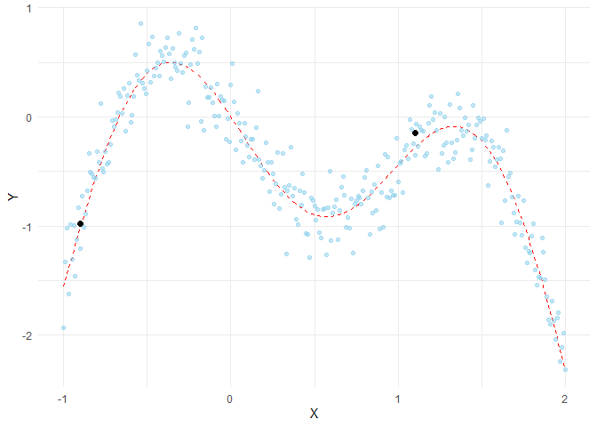<!-- -->

Goal is to find the global optimum on the left in a small number of
steps. The next step is to implement the acquisition function defined in
Equation (2) as `expected_improvement` function.

``` r
expected_improvement <- function(X, X_sample, Y_sample, gpr, xi=0.01, max=TRUE) {
    result <- gpr.predict(X, gpr)
    mu <- result$mu_s
    sigma <- diag(result$cov_s)
    
    result <- gpr.predict(X_sample, gpr)
    mu_sample <- result$mu_s
    
    # Needed for noise-based model
    # otherwise use max(Y_sample)
    if (max) {
        mu_sample_opt <- max(mu_sample)
    } else {
        mu_sample_opt <- min(mu_sample)
    }
    
    imp <- mu - mu_sample_opt - xi
    Z <- imp / sigma
    expected_imp <- imp * pnorm(Z) + sigma * dnorm(Z)
    expected_imp[sigma == 0] = 0
    
    return(expected_imp)
}
```

We also need a function that proposes the next sampling point by
computing the location of the acquisition function maximum. Optimization
is restarted `n_restarts` times to avoid local optima.

``` r
propose_location <- function(acquisition, X_sample, Y_sample, gpr,
                             lower, upper, n_restarts=25, max=TRUE) {
    
    min_obj <- function(X) {
        # Minimization objective is the negative acquisition function
        -acquisition(X, X_sample, Y_sample, gpr, max=max)
    }
    
    min_val = 1
    min_x = NULL
    
    # Find the best optimum by starting from n_restart different random points.
    for (i in 1:n_restarts) {
        x0 <- runif(n = len(lower), min = lower, max = upper)
        res <- optim(par = x0, fn = min_obj, lower = lower,
                     upper = upper, method = "L-BFGS-B")
        
        if (res$value < min_val) {
            min_val <- res$value
            min_x <- res$par
        }
    }
    
    return(min_x)
}
```

Now we have all components needed to run Bayesian optimization with the
algorithm outlined above.

Bayesian optimization runs for 10 iterations. In each iteration, a row
with two plots is produced. The left plot shows the noise-free objective
function, the surrogate function which is the GP posterior predictive
mean, the 95% confidence interval of the mean and the noisy samples
obtained from the objective function so far. The right plot shows the
acquisition function. The vertical dashed line in both plots shows the
proposed sampling point for the next iteration which corresponds to the
maximum of the acquisition function.

``` r
plot_acquisition <- function(X, EI, X_next) {
    ggplot(data=data.frame(x = X, y = EI), aes(x, y)) +
        geom_line(color = "red", size = 0.7) +
        geom_vline(xintercept = X_next, linetype = "dashed") +
        theme_minimal()
}
```

``` r
# Initialize samples
X_sample <- X_init
Y_sample <- Y_init

# Lower and upper bounds
lower <- -1.0
upper <- 2.0
noise <- 0.2

# Initialize Gaussian process as surrogate model
gpr <- gpr.init(sigma_y=noise)

# Number of iterations
n_iter <- 10

for (i in 1:n_iter) {
    # Update Gaussian process with existing samples
    gpr <- gpr.fit(X_sample, Y_sample, gpr)
    
    result <- gpr.predict(X, gpr)
    mu_s <- result$mu_s
    cov_s <- result$cov_s
    
    # Obtain next sampling point from the acquisition function (expected improvement)
    X_next <- propose_location(expected_improvement, X_sample, Y_sample,
                               gpr, lower, upper)
    
    # Obtain next noisy sample from the objective function
    Y_next <- f(X_next, noise)
    
    g <- plot_gp(mu_s, cov_s, X, X_sample, Y_sample)
    g <- g + ggtitle(paste0("Iteration ", i))
    p1 <- g
    
    EI <- expected_improvement(X, X_sample, Y_sample, gpr)
    p2 <- plot_acquisition(X, EI, X_next)
    
    grid.arrange(p1, p2, ncol = 2, heights=unit(0.5, "npc"))
    
    # Add sample to previous samples
    X_sample <- rappend(X_sample, X_next)
    Y_sample <- rappend(Y_sample, Y_next)
}
```

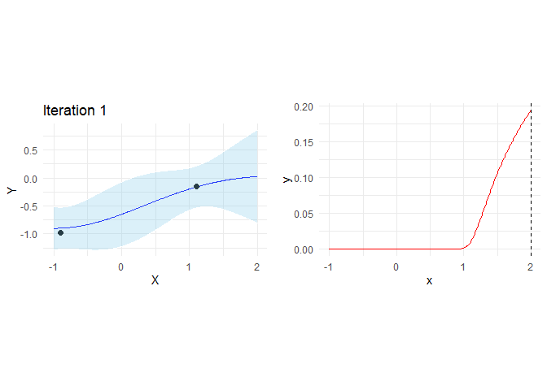<!-- -->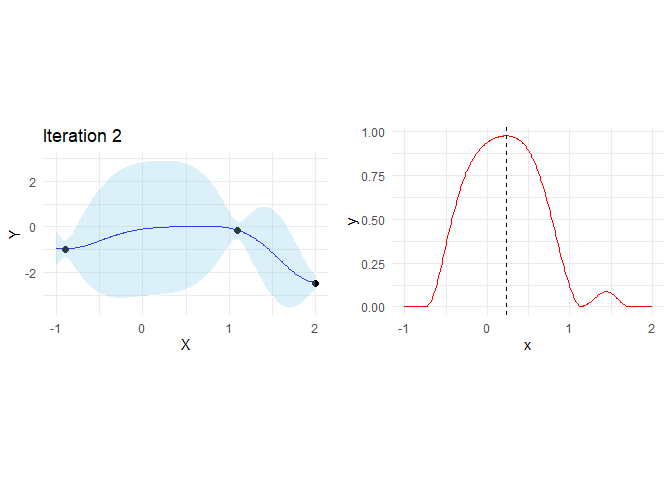<!-- -->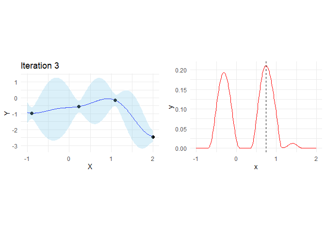<!-- -->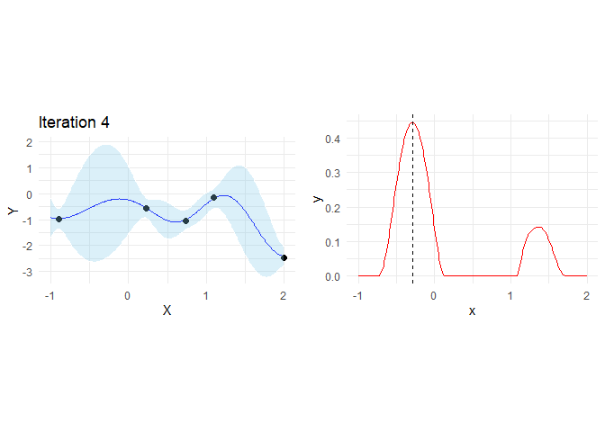<!-- -->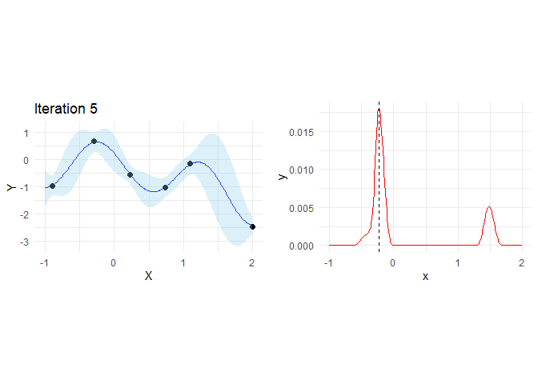<!-- -->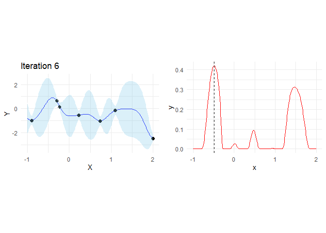<!-- -->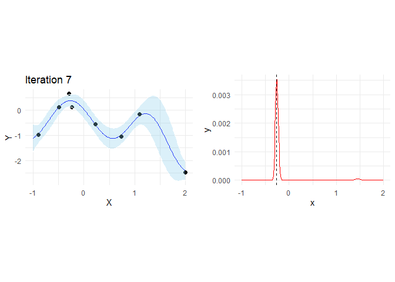<!-- -->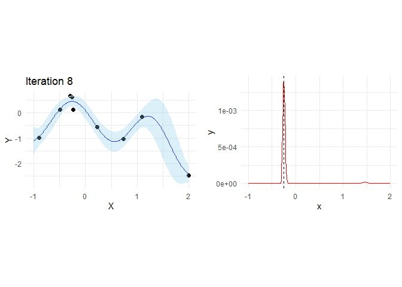<!-- -->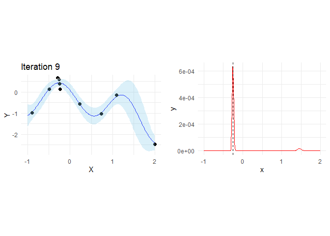<!-- -->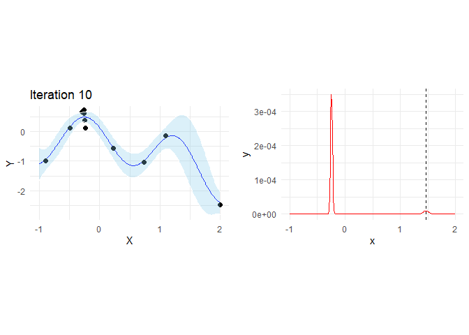<!-- -->
